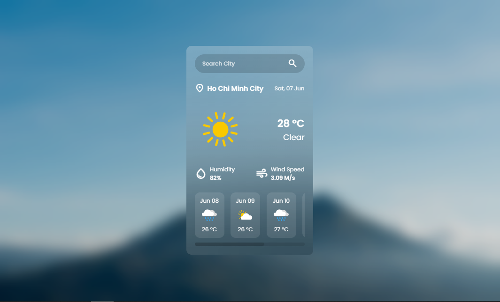

# Weather App: A Journey into API Integration and Web Development Fundamentals

This repository chronicles a significant step in my web development learning journey. Here, I've delved into the practical application of fetching data from a public API (OpenWeatherMap) to build a dynamic and informative weather application. Beyond API integration, this project served as an excellent opportunity to solidify and enhance my foundational skills in HTML, CSS, and JavaScript.



## What I've Learned and Applied:

* **API Integration:** Successfully fetched real-time weather data and 5-day forecasts from the OpenWeatherMap API, demonstrating an understanding of asynchronous JavaScript (`async/await`) and handling API responses.
* **Dynamic Content Generation:** Utilized JavaScript to dynamically update the DOM with fetched weather information, including current conditions, temperature, humidity, wind speed, and a multi-day forecast.
* **Conditional Rendering:** Implemented logic to display different UI states based on API response (e.g., showing weather information, a "city not found" message, or an initial "search city" prompt).
* **Event Handling:** Practiced event listeners for user interactions, such as clicking a search button and pressing the "Enter" key in the input field.
* **Modular JavaScript:** Organized the JavaScript code into logical functions (e.g., `getFetchData`, `updateWeatherInfo`, `getWeatherIcon`) for better readability and maintainability.

## How to Run This Project:

To get this weather application up and running on your local machine, follow these simple steps:

1.  **Clone the Repository:**
    ```bash
    git clone https://github.com/shongon-be/weather-api.git
    ```

2.  **Navigate to the Project Directory:**
    ```bash
    cd <your-project-folder-name>
    ```
    (Replace `<your-project-folder-name>` with the name of the folder after cloning.)

3.  **Open `index.html`:**
    Simply open the `index.html` file in your preferred web browser. You can do this by double-clicking the file or by using your browser's "Open file" option.

    **Note:** This project uses a hardcoded API key for demonstration purposes. And I disabled it after uploading the project to GitHub, please generate your own api key.
## Resources and Further Learning:

Here are some valuable resources that aided in the development of this project and can help you continue your learning journey:

* **OpenWeatherMap API Documentation:** [https://openweathermap.org/api] - Essential for understanding the API endpoints, request parameters, and response structures.
* **MDN Web Docs (Mozilla Developer Network):** [https://developer.mozilla.org/en-US/] - An invaluable resource for comprehensive documentation on HTML, CSS, and JavaScript.
    * Specifically, look into sections on:
        * `fetch` API: [ttps://developer.mozilla.org/en-US/docs/Web/API/Fetch_API]
        * Asynchronous JavaScript (`async/await`): [https://developer.mozilla.org/en-US/docs/Web/JavaScript/Reference/Statements/async_function]
        * DOM Manipulation: [https://developer.mozilla.org/en-US/docs/Web/API/Document_Object_Model]
* **W3Schools:** [https://www.w3schools.com/] - Another great resource for tutorials and examples on web technologies.
* **CSS-Tricks:** [https://css-tricks.com/] - For advanced CSS techniques and best practices.
* **BroCode:** [https://www.youtube.com/watch?v=VaDUGPMjzOM&t=1327s] - Detailed tutorial and very easy to understand.
* **CodeArry:** [https://www.youtube.com/watch?v=krUdJ87uxXc] - Tutorial for building this project.

Feel free to explore the code, suggest improvements, or use it as a stepping stone for your own projects!
